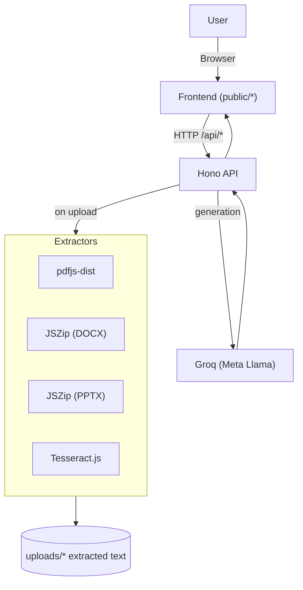
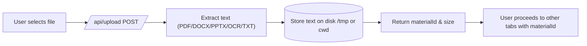
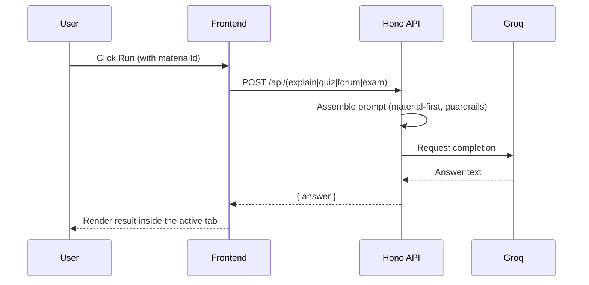
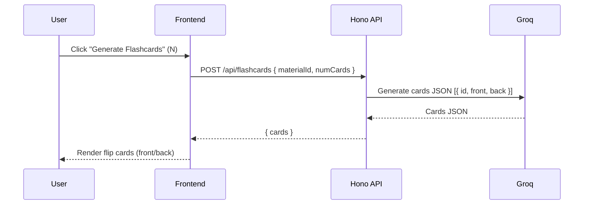

# ILMATRIX — Documentation

ILMATRIX is an AI-powered study companion for university students. It helps explain materials, answer or generate MCQ quizzes with deterministic grading, draft forum replies, prepare for exams responsibly, chat about context, and practice via auto-generated flashcards — all centered on your uploaded materials.

Brand: ILMATRIX
Primary audience: Students and educators
Tech core: Hono.js API, Groq (Meta Llama models), PDF/DOCX/PPTX/OCR extraction, static Tailwind UI, Netlify-ready

## 1) Product Overview

- What it is:
  - A study assistant that uses your uploaded materials first. It explains, answers, and trains directly from your content where possible, quoting relevant snippets for transparency and integrity.
- What it is not:
  - It is not a replacement for studying. It includes guardrails and encourages academic honesty.
- Key differentiators:
  - Material-first design, strong extraction support (PDF, DOCX, PPTX, images via OCR), fast responses powered by Groq, multiple learning modalities (explain, MCQ, flashcards), and deterministic grading for MCQs with per-question rationale/weakness/study-plan embedded.

## 2) Feature Summary

- Upload
  - Supported: PDF, TXT, PNG, JPG/JPEG, DOCX, PPTX
  - Extracts text from each file and stores only the extracted text under a single materialId; original binaries are not persisted
  - Attachments bar: per-file “Remove” buttons and a “Remove all” toolbar action; total per-material cap is 10 MB
  - Retention: a background cleaner auto‑deletes material text files after a TTL (default 60 minutes, configurable via MATERIAL_TTL_MINUTES)
- Explain
  - Structured and concise explanations, with short citations from material when possible
- Quiz (MCQ)
  - Generate N multiple-choice questions (A–E) with embedded answer key, rationale, weaknesses, and study plan per question
  - Deterministic on-device scoring (no LLM) using the embedded keys; for wrong answers only, it prints rationale + weaknesses + study plan
  - Simple answer format accepted: lines of “1 a”, “2 b”, …
- Flashcards
  - Generate N flip-style flashcards (front/back) from materials for quick review
- Forum Reply
  - Drafts respectful, academically coherent replies to forum prompts
- Exam Helper
  - Study-first guidance; encourages integrity and responsible use
- Chat (General)
  - Free-form chat with optional material context
- Dialogue
  - Coached, topic-based conversation grounded in your materials. Start → "Let's get started!" → Send. Use "I'm stuck" for hints; final feedback after 3 topics.

UI color scheme:

- Chat tab: Primary #0f0e85
- Upload tab: Secondary #e44c99
- Other tabs: Tertiary #1b612f

## 3) User Flows (Narrative)

3.1 Upload and Explain

- User opens the App page
- Uploads a PDF/DOCX/PPTX/image/TXT
- System extracts text and returns a materialId
- User navigates to Explain tab, adds a prompt (optional), runs Explain
- System returns a structured explanation with citations (where possible)

  3.2 Quiz (MCQ)

- Set number of MCQs and click Generate MCQ
- UI displays MCQs (A–E options); user enters answers in the simple text box, e.g.:
  1 a
  2 b
  3 c
- Submit & Grade calculates Score X/Y using embedded keys and prints:

  - Per-question lines with Your vs Correct (✅/❌)
  - Only for wrong ones: shows per-question Explanation, Weakness analysis (bullets), and Study plan (bullets)
  - Ends with “Jawaban” listing the correct letters

    3.3 Flashcards

- Set number of cards; click Generate Flashcards
- Cards appear as flip cards; click or press Enter/Space to flip front/back

  3.4 Forum Reply

- Provide forum prompt or topic; run Draft Reply
- System returns a respectful, academically aligned draft

  3.5 Exam Helper

- Provide study instructions or sample questions; run Exam Helper
- System returns guidance that prioritizes learning and ethical preparation

  3.6 Chat (General)

- Type messages to discuss content, clarify answers, or iterate on results
- If a material is uploaded, the assistant uses it as context

  3.7 Dialogue

- Open the Dialogue tab.
- Click Start to receive an "ilmatrix" intro tailored to your material.
- Click "Let's get started!" to get the first coach question for Topic 1.
- Answer in the input and press Send. Ask "How am I doing?" anytime to get progress.
- Click "I'm stuck" for a short hint. After 3 topics, you'll receive final feedback and input will be disabled.
- Mobile UX: a local “+” beside the Dialogue input opens a compact quick menu; the global floating “+” is hidden to avoid duplicates.

## 4) High-level Architecture

- Frontend
  - Static HTML (Tailwind CSS via CDN) in /public
  - Tabs per feature; each tab renders its own results (no result-only page)
  - App page: public/app.html
- Backend
  - Hono.js app exposing /api routes
  - Groq SDK (Meta Llama models) for generation/analysis
  - Extraction utilities for PDF (pdfjs-dist), DOCX/PPTX (JSZip), OCR for images (tesseract.js)
  - Stores extracted text as uploads/<materialId>.txt; a background cleaner auto‑deletes files older than MATERIAL_TTL_MINUTES (default 60)
- Deployment
  - Netlify-compatible (functions for API, static hosting for /public)

Key files (for reference):

- public/app.html — app UI (tabs/features)
- public/index.html — marketing-style Home
- public/about.html — About Us page
- src/server.ts — Hono server/bootstrap
- src/routes.ts — API routes (upload, explain, quiz, forum, exam, chat, mcq-trainer, flashcards)
- src/groqClient.ts — Groq client and prompting logic, MCQ JSON generation, deterministic scoring, flashcards generation
- src/extract/\*.ts — extraction utilities (pdf, docx, pptx, image)
- Optional serverless adapters may be added for Netlify/Vercel; by default the app runs as a Node server via Hono.

## 5) Flowcharts (Mermaid)

5.1 System Overview (Flowchart)



5.2 Upload Flow



5.3 Explain/Quiz/Forum/Exam Flow



5.4 MCQ Quiz (Generate + Grade)

```mermaid
sequenceDiagram
    participant U as User
    participant FE as Frontend
    participant API as Hono API
    participant LLM as Groq
    U->>FE: Click "Generate MCQ" (N)
    FE->>API: POST /api/quiz/trainer/mcq/start { materialId, numQuestions }
    API->>LLM: Generate MCQ JSON { question, options[5], answer, rationale, weaknesses[], studyPlan[] }
    LLM-->>API: JSON MCQs
    API-->>FE: { questions: [...] }
    FE-->>U: Render MCQs; user submits "1 a", "2 b", ...

    U->>FE: Submit
    FE->>API: POST /api/quiz/trainer/mcq/score { questions, userAnswers }
    API->>API: Deterministic scoring using embedded answer keys
    API-->>FE: { analysis } with rationale/weakness/study plan for wrong answers only
    FE-->>U: Show score, per-question results, and final "Jawaban"
```

5.5 Flashcards



## 6) API Reference (Brief)

Base: /api

- GET /api/health

  - Response: { ok: true, uptime: number }

- POST /api/upload

  - Form-data: file may appear multiple times for batch upload (PDF/TXT/PNG/JPG/DOCX/PPTX)
  - To append to an existing material: append=true, mergeTo=<materialId> (or materialId=<id>)
  - Response: { materialId: string, appended: boolean, files: number, size: number, sizeAdded: number, limit: "10MB" }

- POST /api/explain

  - JSON: { materialId: string, prompt?: string }
  - Response: { answer: string }

- POST /api/quiz

  - JSON: { materialId: string, prompt?: string, numQuestions?: number }
  - Response: { answer: string } // may include “Jawaban” section

- POST /api/forum

  - JSON: { materialId: string, prompt: string }
  - Response: { answer: string }

- POST /api/exam

  - JSON: { materialId: string, prompt: string }
  - Response: { answer: string } // includes integrity/ethics guidance

- POST /api/chat

  - JSON: { materialId?: string, messages: Array<{ role: "user"|"assistant"|"system", content: string }> }
  - Response: { answer: string }

- POST /api/quiz/trainer/mcq/start

  - JSON: { materialId: string, numQuestions: number }
  - Response: { questions: MCQQuestion[] } // each has { id, question, options[5], answer, rationale, weaknesses[], studyPlan[] }

- POST /api/quiz/trainer/mcq/score

  - JSON: { materialId: string, questions: MCQQuestion[], userAnswers: Record<number,"A"|"B"|"C"|"D"|"E"> }
  - Response: { analysis: string } // deterministic score + rationale/weakness/study plan for wrong answers only + final Jawaban

- POST /api/flashcards

  - JSON: { materialId: string, numCards: number }
  - Response: { cards: { id:number, front:string, back:string }[] }

- Dialogue

  - POST /api/dialogue/start
    - JSON: { materialId: string }
    - Response: { sessionId: string, language: "id"|"en", intro: string, topics: Array<{ id:number, title:string }>, firstCoachPrompt: string }
  - POST /api/dialogue/step
    - JSON: { materialId: string, topics: Array<{ id:number, title:string }>, currentTopicIndex: number, userMessage: string, lastCoachQuestion?: string, language?: "id"|"en" }
    - Response: { coachMessage: string, addressed: boolean, moveToNext: boolean, nextCoachQuestion?: string }
  - POST /api/dialogue/hint
    - JSON: { materialId: string, currentTopicTitle: string, language?: "id"|"en" }
    - Response: { hint: string }
  - POST /api/dialogue/feedback
    - JSON: { materialId: string, topics: Array<{ id:number, title:string }>, history?: Array<{ role:"coach"|"user"|"ilmatrix"|"system", content:string }>, language?: "id"|"en" }
    - Response: { feedback: string, strengths: string[], improvements: string[] }

- GET /api/material/:id

  - Response: { materialId: string, totalSize: number, files: [{ name: string, size: number, occurrences: number }] }

- POST /api/material/:id/remove
  - JSON: { name: string }
  - Response: { materialId: string, removed: string, totalSize: number, files: [{ name: string, size: number, occurrences: number }] }

## 7) Frontend Structure

- Pages
  - /public/index.html — marketing front page (hero, features, how-it-works, CTA)
  - /public/app.html — app with tabbed UI (Chat first, Upload second, others follow)
  - /public/about.html — about us (mission, story, values, tech, offer, contact)
- Tabs in App (app.html)
  - Chat (primary)
  - Upload (secondary)
  - Explain, Quiz (MCQ), Forum, Exam, Flashcards, Dialogue (tertiary)
- UX notes
  - Each feature renders its result within its own section
  - No “Result” tab; reduce context switching
  - Keyboard focus moves to the first element of the active tab
  - Upload attachments bar shows per-file Remove buttons and a “Remove all” action
  - Dialogue on mobile uses a local “+” quick menu anchored next to the input
  - Flashcards render as flip cards with smooth rotation and keyboard accessibility

## 8) Extraction Support

- PDF: pdfjs-dist configured with fonts and CMaps; supports local and serverless paths. PDF extraction is concurrency‑limited (PDF_EXTRACT_CONCURRENCY, default 2) and frees resources eagerly (page.cleanup(), pdf.cleanup(), pdf.destroy(), loadingTask.destroy()) to prevent memory leaks.
- DOCX: JSZip reads word/document.xml and related parts; converts XML to text
- PPTX: JSZip reads ppt/slides/slideN.xml; extracts <a:t> runs as text
- Images (PNG/JPG): tesseract.js OCR; language fallback from “eng+ind” to “eng”; OCR runs with a hard timeout (OCR_TIMEOUT_MS, default 30000), each worker is terminated to avoid lingering threads, and OCR_CONCURRENCY limits parallel workers (default 1).
- TXT: read as-is

Performance tips:

- Prefer textual PDFs over image-only for faster and cleaner extraction
- Large DOCX/PPTX may need extra time; avoid extremely large uploads on serverless

## 9) Configuration & Deployment

- Environment
  - GROQ_API_KEY must be set for the backend
  - GROQ_MODEL sets the model id (optional; default in code)
  - PORT overrides server port (default 8787)
  - MATERIAL_CLAMP sets the max characters of materials included per request (default 100000). Increase for better recall (higher token usage), decrease to save tokens.
  - MATERIAL_TTL_MINUTES controls on-disk retention of material .txt files (default 60). A background cleaner periodically deletes files older than this TTL.
  - GROQ_CONCURRENCY caps concurrent LLM requests (default 4)
  - GROQ_TIMEOUT_MS per-request timeout for LLM calls in ms (default 45000)
  - PDF_EXTRACT_CONCURRENCY caps concurrent PDF parses (default 2)
  - OCR_TIMEOUT_MS per-recognition timeout for OCR in ms (default 30000)
  - ESM with TypeScript in NodeNext mode; ensure .js extensions on local imports post-emit
- Local development
  - Install dependencies; run dev/start scripts
  - Open /public/index.html (Home) or /public/app.html (App) in the served site, or deploy to Netlify
- Netlify
  - netlify.toml routes /api/\* to functions
  - Static site lives in /public
  - Functions adapter wraps Hono app

## 10) Security, Safety, Integrity

- Material-first prompts encourage quoting short snippets for transparency
- No chain-of-thought; focus on succinct, verifiable reasoning
- Exam Helper and other tasks include academic integrity guidance
- Backend hardening implemented:
  - Path traversal protection for material files (only UUID-like ids accepted; safe path resolution constrained to uploads/)
  - Global per-IP rate limiting (token bucket; default 120 req/min)
  - Best-effort Content-Length guard for uploads to quickly reject oversized requests
- Static site security:
  - Content-Security-Policy (CSP) applied to static pages (index/app/about). In production, pin CDN versions and add Subresource Integrity (SRI).
- Accessibility:
  - Live regions (aria-live="polite", role="log") for chat and dialogue updates
  - Tool buttons include accessible labels/controls/expanded state
- Consider adding next:
  - Basic auth or key gating for public deployments
  - Redaction for PII in uploaded materials where required

## 11) Roadmap Ideas

- Streaming responses (SSE) for better perceived latency
- Persist chat and quiz sessions (localStorage or backend session)
- Markdown rendering in results and chat bubbles
- Per-user profiles and saved materials
- Multi-language OCR packs as optional downloads
- Export to DOCX/PDF of generated study notes and flashcards

## 12) FAQ (Concise)

- Q: Do I need an account?
  - A: For local usage, no. For public deployments, you may add auth.
- Q: How private are my uploads?
  - A: Files are processed for study purposes and stored temporarily as extracted text (.txt), and by default auto‑deleted after ~60 minutes (configurable via MATERIAL_TTL_MINUTES). Review and customize retention for your deployment.
- Q: Can it handle photos/screenshots of slides?
  - A: Yes, via OCR (tesseract.js), but clarity and contrast improve results.
- Q: Which models are used?
  - A: Groq with Meta Llama models (configurable).

## 13) Pseudo Data Models

- UploadResponse

  - { materialId: string, appended: boolean, files: number, size: number, sizeAdded: number, limit: "10MB" }

- ChatMessage

  - { role: "user" | "assistant" | "system", content: string }

- MCQStartRequest

  - { materialId: string, numQuestions: number }

- MCQScoreRequest

  - { materialId: string, questions: MCQQuestion[], userAnswers: Record<number,"A"|"B"|"C"|"D"|"E"> }

- FlashcardsRequest
  - { materialId: string, numCards: number }

## 14) Example Requests

14.1 Upload (curl)

```
# New material, multiple files
curl -X POST http://localhost:8787/api/upload \
  -F "file=@/path/to/file.pdf" \
  -F "file=@/path/to/slides.pptx"

# Append to an existing material
curl -X POST http://localhost:8787/api/upload \
  -F "append=true" -F "mergeTo=a1b2c3d4" \
  -F "file=@/path/to/more.docx"
```

Response:

```
{ "materialId": "a1b2c3d4", "appended": true, "files": 1, "size": 123456, "sizeAdded": 7890, "limit": "10MB" }
```

14.1b List files inside a material

```
curl http://localhost:8787/api/material/a1b2c3d4
```

14.1c Remove a file's content from a material (destructive)

```
curl -X POST http://localhost:8787/api/material/a1b2c3d4/remove \
  -H "Content-Type: application/json" \
  -d '{ "name": "slides.pptx" }'
```

14.2 Explain

```
curl -X POST http://localhost:8787/api/explain \
  -H "Content-Type: application/json" \
  -d '{ "materialId": "a1b2c3d4", "prompt": "Jelaskan bab 2" }'
```

14.3 MCQ Quiz (generate 5)

```
curl -X POST http://localhost:8787/api/quiz/trainer/mcq/start \
  -H "Content-Type: application/json" \
  -d '{ "materialId": "a1b2c3d4", "numQuestions": 5 }'
```

14.4 MCQ Quiz (score)

```
curl -X POST http://localhost:8787/api/quiz/trainer/mcq/score \
  -H "Content-Type: application/json" \
  -d '{ "materialId": "a1b2c3d4", "questions": [...], "userAnswers": { "1":"A","2":"B","3":"C" } }'
```

14.5 Flashcards (generate 5)

```
curl -X POST http://localhost:8787/api/flashcards \
  -H "Content-Type: application/json" \
  -d '{ "materialId": "a1b2c3d4", "numCards": 5 }'
```

## 15) Pages

- Home (/public/index.html): ILMATRIX overview; highlights Explain, MCQ, Flashcards, Forum, Exam, Chat
- About (/public/about.html): Mission, story, values, tech, offering, contact CTA
- App (/public/app.html): Tabbed interface — Upload, Explain, Quiz (MCQ), Forum, Exam, Flashcards

Open the App: /public/app.html
Explore marketing pages: /public/index.html and /public/about.html

## 16) Performance & Memory Safety

- LLM requests are bounded by GROQ_CONCURRENCY and GROQ_TIMEOUT_MS and routed through a single shared client to prevent runaway concurrency and hung requests.
- PDF extraction uses PDF_EXTRACT_CONCURRENCY and explicitly cleans up page and document resources (page.cleanup(), pdf.cleanup(), pdf.destroy(), loadingTask.destroy()) to avoid leaks even on errors/timeouts.
- OCR extraction applies OCR_TIMEOUT_MS and always terminates the Tesseract worker after each recognition to avoid background threads lingering.
- The material TTL cleaner timers use unref() so they do not keep the event loop alive and can be stopped on shutdown; the server installs SIGINT/SIGTERM/beforeExit handlers to clear timers and close the server.
- Recommended defaults: GROQ_CONCURRENCY=4, GROQ_TIMEOUT_MS=45000, PDF_EXTRACT_CONCURRENCY=2, OCR_TIMEOUT_MS=30000, MATERIAL_TTL_MINUTES=60.

---

End of ILMATRIX Documentation
